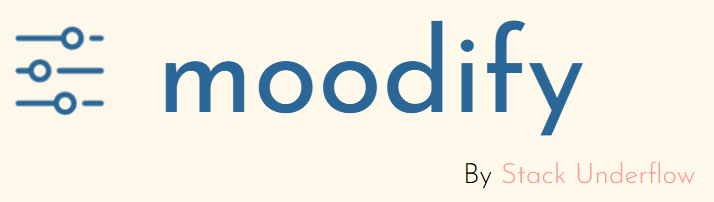

# moodify
<h1 align="center">
  <br>
  <a></a>
</h1>

<h4 align="center">A python based mood tracking journal app</h4>

<p align="center">
  <a href="#key-features">What it does</a> •
  <a href="#how-to-use">Installation</a> •
  <a href="./moodify - Stack Underflow - Presentation.pdf">Presentation</a>
</p>


## What it does

* Sliders to accurate define your emotions and mood
* Personalized response to help you using Gemini
* Journal to track your mood from precious sessions
* Gives you customized route to improving mental health

## Installation

Install dependencies and run app.py

```bash
# Install required dependencies 
pip install -r requirements.txt
python .\app.py
